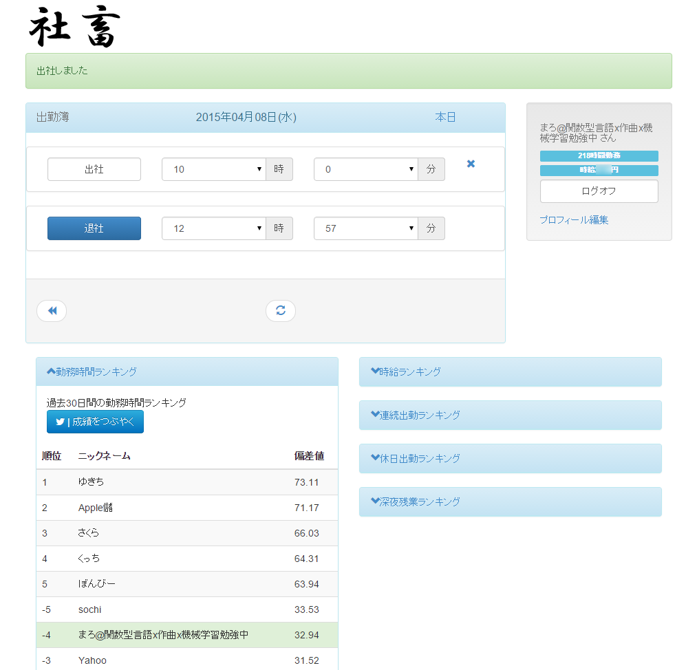

# worker([社畜.net](http://www.syatiku.net/ "社畜.net"))

　[社畜.net](http://www.syatiku.net/ "社畜.net")というサービスのソースコードです。今も稼働中です。
　Clojureで実装し、heroku上で稼動しています。

　楽しく社畜しようというコンセプトの元、勤務時間や休日出勤日数などを競います。
　色々と機能を追加する予定でしたが、開発は停滞しております　(^.^)ご(-.-)め(__)ん(-｡-)ね(^.^)

## 使用言語・ライブラリ

- Clojure
- Ring
- lib-noir
- Compojure
- Korma
- Hiccup
- Twitter4J
- Twitter Bootstrap 3

など

